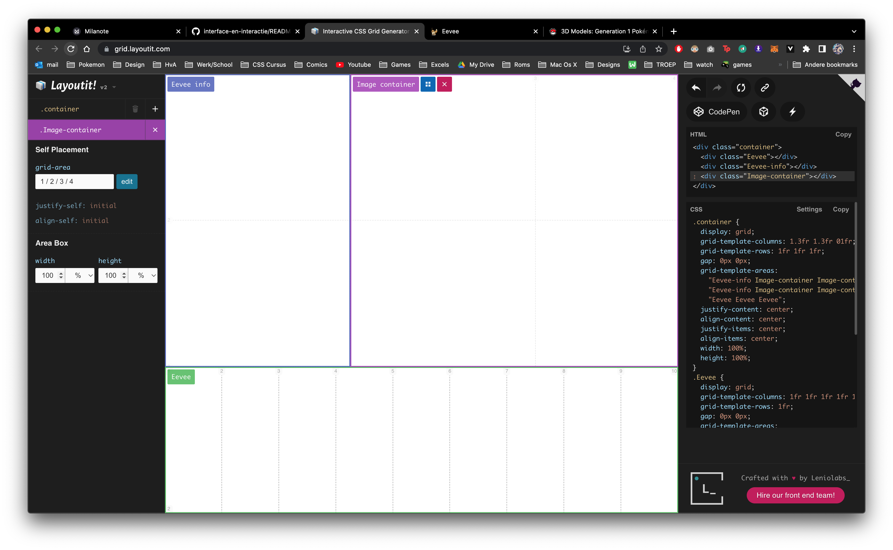
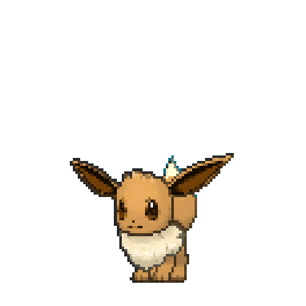

# Procesverslag
Markdown is een simpele manier om HTML te schrijven.  
Markdown cheat cheet: [Hulp bij het schrijven van Markdown](https://github.com/adam-p/markdown-here/wiki/Markdown-Cheatsheet).

Nb. De standaardstructuur en de spartaanse opmaak van de README.md zijn helemaal prima. Het gaat om de inhoud van je procesverslag. Besteedt de tijd voor pracht en praal aan je website.

Nb. Door *open* toe te voegen aan een *details* element kun je deze standaard open zetten. Fijn om dat steeds voor de relevante stuk(ken) te doen.


## Jij

### Ontwerper:
Sam Lansdaal

#### Je startniveau:
Rood


# Je plan

<details open>
  <summary>
  Voor het vak Interface en Interactie heb ik gekozen voor de opdracht over de Pokémon Eevee. <br>
  Ik heb hiervoor gekozen, omdat Pokémon een game is die ik vroeger veel gespeeld heb en omdat de Eevee evolutie mij goed bekend is.
  
    <br>
  
   </summary>

  ### De eerste versie/schets:
  


  ### Je ambitie: 
  Aan deze technieken/punten wil ik werken:
  - Display: Flex
    Voornamelijk wil ik leren positioneren met display flex en justify content etc.
  - Display: Grid
    Ik ga zou graag willen oefenen met het bouwen van een grid. Het liefst werk ik vaak in een verdeling van 3 vlakken en hopelijk gaat dat lukken met display Grid.
  - Geavanceerde selectoren
    :nth-of-type was tot een week voor de opdracht nieuw voor mij. Intussen beheers ik de kennis erover, maar ik ben benieuwd hoe dit nu weer werkt met :hover of ::after
  - Javascript
    Het is en blijft altijd lastig, maar het is wel altijd een goed idee om toch weer even te kijken hoe werkt.
  - @keyframes
    Door veel ervaring met after effects snap ik het principe van keyframes, maar het zal toch wel weer even uitzoeken zijn hoe het in css werkt.
 
</details>


## Voortgang/Feedback 1

<details open>
  <summary>Mijn bevindingen + wijzigingen (minimaal 5)</summary>

  ### Bevinding 1:
  Zoals ik eerder al zei bij de ambities zou ik graag in een vlakverdeling van 3 willen werken. 

  

  #### oplossing:

  In het begin heb ik een aantal schetjes gemaakt in Adobe Xd. <br>
  
  
  
  
  <br>
  Uiteindelijk heb ik toen de keuze gemaakt voor de laatste schet. Ik heb toen veel geprobeerd met Display:Grid, maar ik kwam er steeds niet helemaal    lekker uit. Uiteindelijk vond ik de volgende website: https://grid.layoutit.com/.
  Hier heb ik mijn layout gemaakt en de html en css gekopieerd.
  
  


  ### Bevinding 2:
  Toen ik eenmaal het grid gekopieerd had moest er nog veel gebeuren aan uitlijningen en styling.

  #### oplossing:
  Ik ben hiervoor toen naar "https://css-tricks.com/snippets/css/a-guide-to-flexbox/" gegaan en heb alles weer even rustig doorgelezen. Daarna ben ik gaan proberen en kwam ik erachter dat ik display: Flex; eindelijk begreep.
  
  ```css
  .container {
  display; flex;
  justify-content: center;
  align-items: items:
  }
  ```

  De bovestaande code centreert de items in de container. Dit is iets wat ik heel vaak gebruikt heb.

  ### Bevinding 3:
  In het begin twijfelde ik nog welke sprites ik wilde gebruiken. <br>
  
   <br>
  Ik heb er volgens voor gekozen om de rechter sprite te gebruiken, omdat deze een gif bestand is.
  Vervolgens heb ik voor alle Eeveelutions een gif gedownload op de volgende website: https://projectpokemon.org/home/docs/spriteindex_148/3d-models-generation-1-pok%C3%A9mon-r90/.
  
  
  ### Bevinding 4:
  
  Toen ik gekozen had om de Eevee sprites te kiezen die ik nu gebruikt hebt was het tijd om deze in Photoshop en Illustrator te bewerken.
  In Illustrator heb ik alle Eeveelutions op een rijtje gezet om de grote te bepalen van de sprites en van het kader eromheen.
  
  
  
  
</details>


## Voortgang/Feedback 2

<details open>
  <summary>Mijn bevindingen + wijzigingen (minimaal 5)</summary>
  
  De gehele duratie van de opdracht had ik gebruik gemaakt van mijn laptop om mijn opdracht te maken. Ongeveer halverwege de ontwerp opdracht opende ik de website thuis op mijn PC. De 2 websites zagen er niet hetzelfde uit, dus dat was niet goed... Ik ben toen gaan zoeken wat er aan de hand was en het bleek dus dat ik op mijn laptop had gewerkt terwijl de browser grootte op 50% stond. Vervolgens ben ik toen door mijn css heen gegaan om alle ```"font-sizes"``` te zoeken. 
  
  
  
  ### Bevinding 1:
  Omschrijving van wat er nog niet orde was (tekst en afbeeding(en)).
  
  background: image, image;

  #### oplossing:
  Beschrijving hoe je het hebt hebt opgelost of als het niet gelukt is hoe je het zou oplossen (tekst en afbeeding(en)).


  ### Bevinding 2:
  Omschrijving van wat er nog niet orde was (tekst en afbeeding(en)).
  Tijdens één van de feedback rondes kwam ik erachter dat ik teksten had die niet in <p> elementen stonden. Ik was dit eerlijk gezegd compleet vergeten en heb nog een hoop css dingen moeten aanpassen om tekst in <p> elementen te krijgen. Ook werd er gezegd dat ik mijn :focus states nog moest instellen op de knoppen onderin. 

  #### oplossing:
  Beschrijving hoe je het hebt hebt opgelost of als het niet gelukt is hoe je het zou oplossen (tekst en afbeeding(en)).


  ### Bevinding 3:
  Tijdens het testen van mijn website heb ik een oud klasgenoot gevraagd om te komen kijken. Het viel al gauw op dat hij op de knop linksboven in klikte. Ik was hier al bang voor in verband met een matige visuele hiërarchie. Ik heb toen wat aanpassingen in het grid gedaan en kwam vervolgens op de volgende indeling.
  
  


</details>


## Voortgang/Feedback 3

<details open>
  <summary>Mijn bevindingen + wijzigingen (minimaal 5)</summary>
  
  ### Bevinding 1:
  Omschrijving van wat er nog niet orde was (tekst en afbeeding(en)).

  #### oplossing:
  Beschrijving hoe je het hebt hebt opgelost of als het niet gelukt is hoe je het zou oplossen (tekst en afbeeding(en)).


  ### Bevinding 2:
  Omschrijving van wat er nog niet orde was (tekst en afbeeding(en)).

  #### oplossing:
  Beschrijving hoe je het hebt hebt opgelost of als het niet gelukt is hoe je het zou oplossen (tekst en afbeeding(en)).


  ### Bevinding 3:
  ...

</details>

Waarom heb ik voor de pixel images van pkmns gekozen (de sprites van de oude games)
Gebruik gemaakt van progressive disclosure
Eevee menu bovenin in verband met de flow

## Reflectie

<details>
  <summary>Mijn eindresultaat & persoonlijke ontwikkeling</summary>

  ### Je uitkomst - karakteristiek screenshot(s):
  


  ### Dit ging goed/Heb ik geleerd: 
  Korte omschrijving met plaatje(s)

  


  ### Dit was lastig/Is niet gelukt:
  Korte omschrijving met plaatje(s)

  
</details>


## Bronnenlijst

<details open>
<summary>continu bijhouden terwijl je werkt</summary>

Nb. Wees specifiek ('css-tricks' als bron is bijv. niet specifiek genoeg).

1. Info over de Pokémons https://bulbapedia.bulbagarden.net/wiki/ & https://pokemondb.net/pokedex/ en https://pokemon.fandom.com/wiki/Eevee#Generation_VIII
2. Types image https://twitter.com/RicoPicoProject/status/1261695478120321024/photo/1
3. 
4. Achtergrond patronen https://www.magicpattern.design/tools/css-backgrounds
5. Startcode voor het grid https://grid.layoutit.com/
6. 3D Pokémon sprites https://projectpokemon.org/home/docs/spriteindex_148/3d-models-generation-1-pok%C3%A9mon-r90/
7. Leaves Patterb https://patternpad.com/editor.html
8. Patronen voor de achtergronden https://codepen.io/fantaghiro/pen/yLoLjg
9. Gradients https://cssgradient.io/
10. Sneeuwvlok https://www.onlinewebfonts.com/icon/540450
11. Bliksem https://www.svgrepo.com/svg/20303/lightning
12. Pixel pokemon http://pixelartmaker.com/art/8f8dd93f7aae3e7
13. Pokemon geluiden (Cries) https://play.pokemonshowdown.com/audio/cries/
14. Achtergrond patronen https://www.magicpattern.design/tools/css-backgrounds
15. Cirkel animatie https://codepen.io/shooft/pen/MWOjqJM
16. Favicon generator en Eevee image https://www.favicon-generator.org/ & https://iconscout.com/icon/eevee-eievui-pokemon-cartoon-game-video-pokemongo 


</details>
